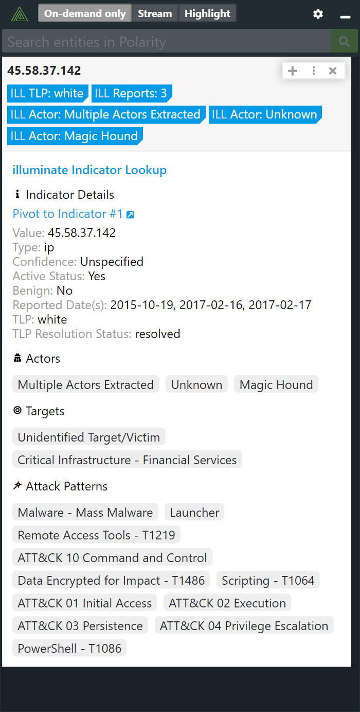
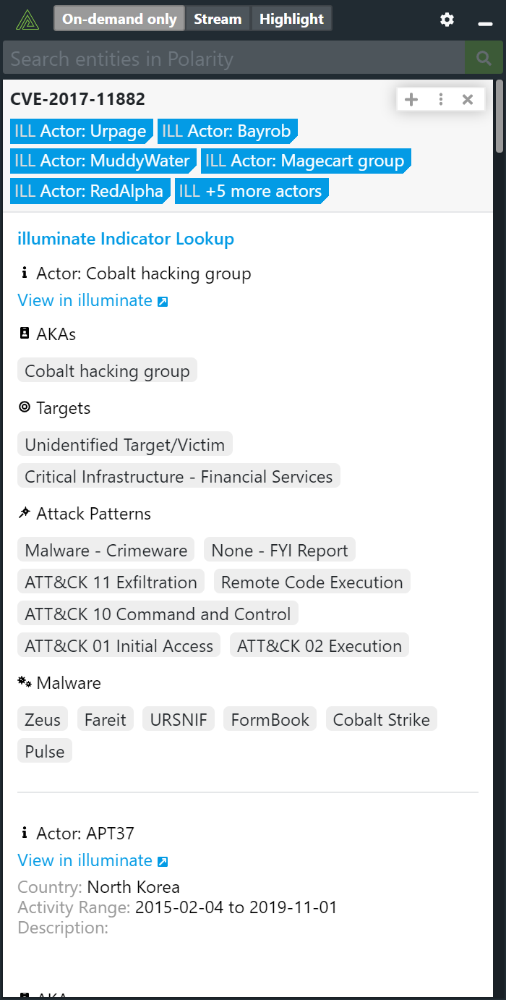

# Polarity Analyst1 Integration

The Polarity Analyst1 integration allows Polarity to quickly identify indicators and CVEs contained within the Analyst1 platform.

|  |  |
|---|--|
|*Analyst1 Indicator results* | *Analyst1 CVE results* |

## Analyst1 Integration Options

### Analyst1 API URL

The base URL for the Analyst1 API to include the schema (https://) and port as needed

### User Name

Valid Analyst1 Username

### Password

Valid Analyst1 Password

### Match Indicator Values

If checked, the integration will only return results for a matched indicator value. If unchecked, a full text search will be run for the given indicator. To prevent large amounts of false positives it is recommended to keep this option checked.

## Installation Instructions

Installation instructions for integrations are provided on the [PolarityIO GitHub Page](https://polarityio.github.io/).

## Polarity

Polarity is a memory-augmentation platform that improves and accelerates analyst decision making.  For more information about the Polarity platform please see:

https://polarity.io/
